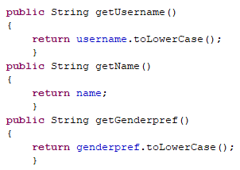
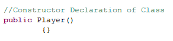

# yeozhenhao's Matching Depth-First Search (DFS) algorithm on Java for Delicacies Matchmaking
## About my first Java project
##### <ins>About Delicacies Matchmaking</ins>
###### A Telegram app to chat anonymously with potential dates:
Delicacies Matchmaking is a Singapore-wide anonymous dating event for university students, with an average of 400+ signups per event. I run it every few months and the idea was conceived & actualized solely by me in Dec 2021. It is a 100% online Telegram event where every participant gets two random and anonymous matches that fit their Gender, Age, Race, Religion & Relationship preferences *(matching is done with a Depth First Search algorithm)*. Participants have **one month** to chat with their matches, and it will be up to them to reveal their identities before the app is taken down.

Matches chat anonymously with one another through two Telegram bots, one for each match. The bots enable anonymity, which helps to lower the consequences of making a bad first impression or faux pas. To break the ice, matches can find out more about each other through details they have declared at sign-up such as **Two Truths One Lie, Fun Facts, Interests, Dealbreakers** & **responses to 40 fun icebreaker questions**. An example of the 40 icebreaker questions can be seen [here](https://docs.google.com/spreadsheets/d/1k2IsHvhYo4gminzRAg9qW_9qqUREXl0brioESlH1_B4/edit?usp=sharing).

According to my Delicacies Matchmaking PDPA policy, we destroy all online & offline sign-up and matchmaking data after every event.

###### The bots will be taken down at the end of the month:
Interested matches can decide to reveal their Telegram usernames to each other to continue chatting, and uninterested matches can decide against revealing. After the bots are taken down, all the online & offline sign-up and matching data is destroyed, so the participants will never know who their matches are.

> To reveal or not to reveal — it is completely up to the participants

##### <ins>Why I created an algorithm in Java</ins>
Having seen that Delicacies has helped successfully matched couples from hearsay, I dreamt of turning Delicacies Matchmaking into an actual mobile dating app.
However, I knew one of the biggest challenge is to create a matchmaking algorithm in Java, as the current Python matchmaking algorithm could not be used on native platforms such as Java on Android.
Thus, I set out to do something crazy: **recreating a Depth-First Search algorithm from scratch by myself, in the Java coding language that I have never touched before**

##### <ins>The pain and reward of learning a new coding language</ins>
Sure enough, I faced many challenges which although enriching, were extremely *painful*.
I not only had to learn all the new Java objects, coding structure, syntaxes and more, I also had to dabble quite deep in Graph Theory Data Structures with the Java module [JGraphT](https://jgrapht.org/) to use a **Strongly Connected Components algorithm** to eventually make a fast Depth-First Search matchmaking algorithm.  

For example, the first task I embarked on was to create functions that "simply" import the Excel player list data into Java as Java objects, which would then be evaluated through the Depth-First Search algorithm.
Turns out, this was not simple at all as this first task took **12 hours** as I was getting confused by following outdated tutorials on how to use OpenCSV module in Java, and was also having a difficult time creating new code with the new *Builder* & *Mapping Strategy* classes in the latest **OpenCSV Java module** (which worked very differently from classes in Python).

The OpenCSV module is essential in importing Excel data as Java objects which can then be manipulated easily in algorithms.

Thus, after several hours of trial and error with OpenCSV module's many Builder and MappingStrategy classes, I finally got it to work after 12 hours of working on the project, but it nearly destroyed my confidence in completing this project.
I thought to myself, *"How can I complete this project if I took 1 day just to import an Excel file?"*
I almost gave up on this project.

Now that I have completed the project after **6 full days** of working on this project, I am glad I pushed through the thousands of runtime errors I encountered, as I finally now understood the capabilities, coding structure and even limitations of Java.

##### <ins>What I learnt about Java</ins>
Java is really the bigger and more efficient brother of Python.
The numerous classes with builder classes, Java bean objects, and Java really gives you almost unlimited capability to create and process anything you want in a much faster way than Python.
One example is Java's ability to concurrently run functions (the *concurrent processing feature* of Java), whereas Python only runs one function at any time in a script.
Although the *concurrent processing feature* of Java was not used in this algorithm, the Java algorithm still ran **noticeably faster** than the Python algorithm in matchmaking <ins>over 400 players</ins>. It is well-known from benchmarks that **Java is more energy-efficient and faster than Python**, as seen [in this article](https://devm.io/java/energy-efficient-programming-languages-137264).

The drawback for efficiency is that you have to declare every single intuitive part of the code.\
Every single Java variable/class had to be declared specifically with what type(s) of data they should accept.\
To illustrate, you create a **Python** tuple object (i.e. a collection which is ordered and unchangeable) by simply declaring:\
`tuple_test = (Player01, Player02)`\
where "Player01" and "Player02" are *Player* objects.\
However, you create a **Java** tuple object by using the in-built *Pair* Java data structure and declaring:\
`Pair<Player,Player> tuple_test = new Pair<> (Player01, Player02)`\
The code means *tuple_test* is of the Java object/class *Pair* which can accept a tuple data structure of *Player* objects) before you could use *tuple_test* in the matchmaking algorithm.
 
For instance, I learnt that Java is **not beginnner-friendly at all** when compared to Python in that if you tried to run algorithms that required Java to process **over 300,000 possibilities of matchmaking 400+ players**, Eclipse (the IDE to code and run this Java script) will freeze and give an *OutOfMemory* Java error.\
Whereas in Python algorithms, you do not need to worry about memory management as it is automatically done for you; in the background, Python seems to handle the 300,000+ possibilities without breaking down.

However in Java, you have to manually manage the memory usage. I eventually fixed this problem by throwing away a huge percentage of possibilities that I know would likely be useless. (I will explain this solution in detail later in this article)

## About the Algorithm
##### <ins>Why I made my repository public</ins>
My Python coding skills was developed by heavily studying & recoding the [public repository of the Python matchmaking algorithm by Sriram Sami](https://github.com/frizensami/archangel), which I implemented in my Delicacies Matchmaking project. I am grateful for such a good learning opportunity.\
Hence, I wish to give back to the community by sharing the matchmaking algorithm in Java coding language for anyone interested to learn about **algorithms in Java** using **Graph Theory Data Structures**.

Thus, I will explain every part of my algorithm in Java henceforth.

#### <ins>Basics of any algorithm</ins>
##### <ins>1. Player.java: Creating the Player class to store player data as Java objects</ins>
###### A. Defining the attributes of the class
We plan to create an algorithm in just one *Java package*, containing multiple *.java* files (where each *.java file* contains class[es] of functions). For our Player class to be used in other *.java files*, we need to define a **public** class as a *private* class will not be able to be accessed by other *.java* files in the same [or different] *Java package*. Thus, we also want our class attributes to be **public** too.

Also, you must define the type of data that the attributes accept (e.g. String, int [which stands for Integer]).
```
public String username;
public String name;
public String genderpref;
```
But how does the *OpenCSV Java module* knows that these attributes are associated with a particular column in the Excel file?
Thus, we need to add one more line of code for each attribute. For example, for the Telegram username, we add:
```
@CsvBindByName(column = "Telegram Username", required = true)
	public String username;
```
The column name is the exact name of the Excel column, and the @CsvBindByName is an [annotation](https://docs.oracle.com/javase/tutorial/java/annotations/) that provides supplemental information about a program.

The *Serializable* Java class is also imported into this *.java file* and implemented in the Player class. This is done to ensure that the Player class (aka Java object) can be defined by bytes and hence be easily transferred across networks, disk drives, etc. and these objects can be re-created in any other machine that has Java installed as the bytes contain sufficient data to do so.

| 
|:---:| 
|*Class attributes to define the Username, Name and Gender Preference*|


###### B. Create the getters and setters in the class
Defining a class is easy but you still need to define the functions to retrieve and set attributes for the class. Basically, you need getters and setters.\
Getters are functions that enable you to retrieve a specific attribute data from any Player object.\
The *Java function* **.ToLowerCase()** easily enables you to only **return** the lower-case form of a String attribute.

| 
|:---:| 
|*Getters*|

Setters are the opposite; they enable you to set a specific attribute data from any Player object.\ 
Note that we need to define each setter function as **void** as we do not expect setter functions to return any value to us.\
**this** is used to refer to the Player object in question.
Basically, we will set the attribute of the <ins>specific instance</ins> of the Player object when the setter function is called.

| 
|:---:| 
|*Setter functions to help you set the Telegram username, Name, and Gender preference*|

> If you have a sharp eye, you would notice that the name of these functions all start with a "get" or "set", followed by a capitalised name of the variable. This is done by convention, and this convention enables the OpenCSV Java module to create these Java objects from the Excel data.


###### C. Create the Player class constructor
Before the Player object can be used, you need to create a constructor function so you can create instances of Player objects.

| 
|:---:| 
|*Constructor - as simple as it is essential*|
  
###### D. Add other useful Player class functions as required
Your Player class is ready, but you can add as many other functions as you'd like.\
For example, I added a function so I could easily compare two Player's usernames together and ensure that they do not match.
This is extremely useful for my algorithm later.

| 
|:---:| 
|*Being able to call Certain_Player.isEqual(Other_Player) to check for duplicates is important for my algorithm*|

