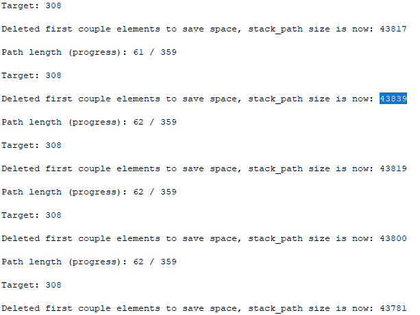

# yeozhenhao's Matching Depth-First Search (DFS) algorithm on Java for Delicacies Matchmaking
## About my first Java project
##### <ins>About Delicacies Matchmaking</ins>
###### A Telegram app to chat anonymously with potential dates:
Delicacies Matchmaking is a Singapore-wide anonymous dating event for university students, with an average of 400+ signups per event. I run it every few months and the idea was conceived & actualized solely by me in Dec 2021. It is a 100% online Telegram event where every participant gets two random and anonymous matches that fit their Gender, Age, Race, Religion & Relationship preferences *(matching is done with a Depth First Search algorithm)*. Participants have **one month** to chat with their matches, and it will be up to them to reveal their identities before the app is taken down.

Matches chat anonymously with one another through two Telegram bots, one for each match. The bots enable anonymity, which helps to lower the consequences of making a bad first impression or faux pas. To break the ice, matches can find out more about each other through details they have declared at sign-up such as **Two Truths One Lie, Fun Facts, Interests, Dealbreakers** & **responses to 40 fun icebreaker questions**. An example of the 40 icebreaker questions can be seen [here](https://docs.google.com/spreadsheets/d/1k2IsHvhYo4gminzRAg9qW_9qqUREXl0brioESlH1_B4/edit?usp=sharing).

According to my Delicacies Matchmaking PDPA policy, we destroy all online & offline sign-up and matchmaking data after every event.

###### The bots will be taken down at the end of the month:
Interested matches can decide to reveal their Telegram usernames to each other to continue chatting, and uninterested matches can decide against revealing. After the bots are taken down, all the online & offline sign-up and matching data is destroyed, so the participants will never know who their matches are.

> To reveal or not to reveal — it is completely up to the participants

##### <ins>Why I created an algorithm in Java</ins>
Having seen that Delicacies has helped successfully matched couples from hearsay, I dreamt of turning Delicacies Matchmaking into an actual mobile dating app.
However, I knew one of the biggest challenge is to create a matchmaking algorithm in Java, as the current Python matchmaking algorithm could not be used on native platforms such as Java on Android.
Thus, I set out to do something crazy: **recreating a Depth-First Search algorithm from scratch by myself, in the Java coding language that I have never touched before**

##### <ins>The pain and reward of learning a new coding language</ins>
Sure enough, I faced many challenges which although enriching, were extremely *painful*.
I not only had to learn all the new Java objects, coding structure, syntaxes and more, I also had to dabble quite deep in Graph Theory Data Structures with the Java module [JGraphT](https://jgrapht.org/) to use a **Strongly Connected Components algorithm** to eventually make a fast Depth-First Search matchmaking algorithm.  

For example, the first task I embarked on was to create functions that "simply" import the Excel player list data into Java as Java objects, which would then be evaluated through the Depth-First Search algorithm.
Turns out, this was not simple at all as this first task took **12 hours** as I was getting confused by following outdated tutorials on how to use **OpenCSV module** in Java, and was also having a difficult time creating new code with the new *Builder* & *Mapping Strategy* classes in the latest **OpenCSV Java module** (which worked very differently from classes in Python).

The OpenCSV module is essential in importing Excel data as Java objects which can then be manipulated easily in algorithms.

Thus, after several hours of trial and error with OpenCSV module's many Builder and MappingStrategy classes, I finally got it to work after 12 hours of working on the project, but it nearly destroyed my confidence in completing this project.
I thought to myself, *"How can I complete this project if I took 1 day just to import an Excel file?"*
I almost gave up on this project.

Now that I have completed the project after **6 full days** of working on this project, I am glad I pushed through the thousands of runtime errors I encountered, as I finally now understood the capabilities, coding structure and even limitations of Java.

##### <ins>What I learnt about Java</ins>
Java is really the bigger and more efficient brother of Python.
The numerous classes with builder classes, Java bean objects, and Java really gives you almost unlimited capability to create and process anything you want in a much faster way than Python.
One example is Java's ability to concurrently run functions (the *concurrent processing feature* of Java), whereas Python only runs one function at any time in a script.
Although the *concurrent processing feature* of Java was not used in this algorithm, the Java algorithm still ran **noticeably faster** than the Python algorithm in matchmaking <ins>over 400 players</ins>. It is well-known from benchmarks that **Java is more energy-efficient and faster than Python**, as seen [in this article](https://devm.io/java/energy-efficient-programming-languages-137264).

The drawback for efficiency is that you have to declare every single intuitive part of the code.\
Every single Java variable/class had to be declared specifically with what type(s) of data they should accept.\
To illustrate, you create a **Python** tuple object (i.e. a collection which is ordered and unchangeable) by simply declaring:\
`tuple_test = (Player01, Player02)`\
where "Player01" and "Player02" are *Player* objects.\
However, you create a **Java** tuple object by using the in-built *Pair* Java data structure and declaring:\
`Pair<Player,Player> tuple_test = new Pair<> (Player01, Player02)`\
The code means *tuple_test* is of the Java object/class *Pair* which can accept a tuple data structure of *Player* objects) before you could use *tuple_test* in the matchmaking algorithm.
 
For instance, I learnt that Java is **not beginnner-friendly at all** when compared to Python in that if you tried to run algorithms that required Java to process **over 300,000 possibilities of matchmaking 400+ players**, Eclipse (the IDE to code and run this Java script) will freeze and give an *OutOfMemory* Java error.\
Whereas in Python algorithms, you do not need to worry about memory management as it is automatically done for you; in the background, Python seems to handle the 300,000+ possibilities without breaking down.

However in Java, you have to manually manage the memory usage. I eventually fixed this problem by throwing away a huge percentage of possibilities that I know would likely be useless. (I will explain this solution in detail later in this article)

## About the Algorithm
##### <ins>Why I made my repository public</ins>
My Python coding skills was developed by heavily studying & recoding the [public repository of the Python matchmaking algorithm by Sriram Sami](https://github.com/frizensami/archangel), which I implemented in my Delicacies Matchmaking project. I am grateful for such a good learning opportunity.\
Hence, I wish to give back to the community by sharing the matchmaking algorithm in Java coding language for anyone interested to learn about **algorithms in Java** using **Graph Theory Data Structures**.

Thus, I will explain every part of my algorithm in Java henceforth.

#### <ins>Basics of any algorithm</ins>
##### <ins>1. Player.java: Creating the Player class to store player data as Java objects</ins>
Ideally, player sign-up data will be stored in an Excel, which can be imported into the Java script. Each row in the Excel contains the sign-up data of one player.

They will need to be stored in a Java object which can be manipulated in the Java script to find suitable dating matches.

###### A. Defining the attributes of the class
We plan to create an algorithm in just one *Java package*, containing multiple *.java* files (where each *.java file* contains class[es] of functions). For our *Player* class to be used in other *.java files*, we need to define a **public** class as a *private* class will not be able to be accessed by other *.java* files in the same [or different] *Java package*. Thus, we also want our class attributes to be **public** too.

Also, you must define the type of data that the attributes accept (e.g. String, int [which stands for Integer]).
```
public String username;
public String name;
public String genderpref;
```
But how does the **OpenCSV Java module** know that these attributes are associated with a particular column in the Excel file?
Thus, we need to add one more line of code for each attribute. For example, for the Telegram username attribute, we add:
```
@CsvBindByName(column = "Telegram Username", required = true)
	public String username;
```
The column name is the exact name of the Excel column, and the @CsvBindByName is an [annotation](https://docs.oracle.com/javase/tutorial/java/annotations/) that provides supplemental information about a program.

The [*Serializable* Java class](https://docs.oracle.com/javase/tutorial/jndi/objects/serial.html#:~:text=To%20serialize%20an%20object%20means,io.) is also imported into this *.java file* and implemented in the *Player* class. This is done to ensure that the *Player* class (aka Java object) can be defined by bytes and hence be easily transferred across networks, disk drives, etc. and these objects can be re-created in any other machine that has Java installed as the bytes contain sufficient data to do so.

| 
|:---:| 
|*Class attributes to define the Username, Name and Gender Preference*|


###### B. Create the getters and setters in the class
Defining a class is easy but you still need to define the functions to retrieve and set attributes for the class. Basically, you need getters and setters.

Getters are functions that enable you to retrieve a specific attribute data from any Player object.\
The *Java function* **.ToLowerCase()** easily enables you to only **return** the lower-case form of a String attribute.

| 
|:---:| 
|*Getters*|

Setters are the opposite; they enable you to set a specific attribute data from any Player object.\ 
Note that we need to define each setter function as **void** as we do not expect setter functions to return any value to us.

The [**this** Keyword](https://www.w3schools.com/java/ref_keyword_this.asp) is used to refer to the Player object in question.
Basically, we will set the attribute of the <ins>specific instance</ins> of the Player object when the setter function is called.

| 
|:---:| 
|*Setter functions to help you set the Telegram username, Name, and Gender preference*|

> If you have a sharp eye, you would notice that the name of these functions all start with a "get" or "set", followed by a capitalised name of the variable. This is done by convention, and this convention enables the OpenCSV Java module to create these Java objects from the Excel data.


###### C. Create the Player class constructor
Before the Player object can be used, you need to create a constructor function so you can create instances of Player objects.

| 
|:---:| 
|*Constructor - as simple as it is essential*|
  
###### D. Add other useful Player class functions as required
Your *Player* class is ready, but you can add as many other functions as you'd like.\
For example, I added a function so I could easily compare two Player's usernames together and ensure they do not match.
This is extremely useful for my algorithm.

| 
|:---:| 
|*Being able to call Certain_Player.isEqual(Other_Player) to check for duplicates is important for my algorithm*|


##### <ins>2. Graphing.java: Creating the main algorithm function</ins>
We will now move to another *.java* file where the main algorithm will be run in.
###### A. Create the top-level public class and public function
Each *.java* file can contain many functions, but you must have a class to contain functions. If the top-level class is **public**, then the name of the top-level **public** class must be the same name as the *.java* file. E.g. a top-level **public** function must be named "*Graphing*" in the *Graphing.java* file. See [this article](https://stackoverflow.com/questions/1841847/can-i-compile-a-java-file-with-a-different-name-than-the-class#:~:text=The%20main%20reason%20for%20the,and%20class%20name%20as%20same.) and [this article](https://stackoverflow.com/questions/968347/can-a-java-file-have-more-than-one-class) for more explanation.

After creating the **public** class Graphing in *Graphing.java*, we need to create the *main* function. The *main* function of the top-level **public** class is executed by simply running the *Graphing.java* script. If our algorithm is in the *main* function of the top-level **public** class, the algorithm is simply executed by running the *Graphing.java* script.

The *main* function must be **public**, **static** and **void**. [This article](https://www.journaldev.com/12552/public-static-void-main-string-args-java-main-method#:~:text=Java%20main%20method%20is%20the,be%20written%20as%20String...) explains more in-depth. 

| 
|:---:| 
|*First 10% of the main function - final result*|

###### B. Editing the main function to enable OpenCSV to import Excel player data with the Player class we just created

Ignore the lines of code containing the **final** Keyword for now.

First, we define the input - our player data will be stored in "playerlist.csv".\
We also define the output - we want the successfully matched players to be stored in "Accepted Players List.csv", and rejected players to be stored in "Rejected Players List.csv".

Next, we need to create a **HashMap** (named *columnMapping*) to map the column names to the name of the attributes of the *Player* class. The attribute names and column names must exactly match what we type in the code. A **HashMap** Java data structure enables us to store a key-value pair of Strings. See [this article](https://www.geeksforgeeks.org/java-util-hashmap-in-java-with-examples/) for examples. 

**OpenCSV Java module** accepts a *Mapping Strategy* to know data in which columns should go to which Player attributes. Thus, we create a *mappingStrategy*, and set it so that it links the *Player* class to the *columnMapping* we just created.

Now, we need to use the *CsvToBeanBuilder* class in **OpenCSV Java module** to enable conversion of the Excel data into *Java Beans* (aka Java Player objects that follow a conventional standard) which can be manipulated in the algorithm for the matchmaking. In short, Java Bean is just a standard that many Java classes conventionally follow. The standard includes being Serializable, and having getters & setters. See [this article](https://stackoverflow.com/questions/8629173/difference-between-java-bean-and-java-class) for information.

Finally, we want every single row of player data to be imported as a list of Player objects (which will allow for much easier manipulation in the algorithm).\
The code to do this is simply:

```
List<Player> player_list = beanBuilder.withType(Player.class).withMappingStrategy(mappingStrategy).build().parse();
```
#### <ins>Advanced - combining Graph Theory and Depth-First Search for a fast matchmaking algorithm</ins>

##### <ins>1. Graphing.java: Creating the Graph Theory part of the algorithm</ins>
We need to create an algorithm that generates a *Hamiltonian path* through a directed graph. A [*Hamiltonian path*](https://en.wikipedia.org/wiki/Hamiltonian_path) is a path in an undirected or directed graph that visits each vertex exactly once. With a *Hamiltonian path* (example in red below), the two adjacent points of a vertex in the path will be the 2 matches that a player can chat with anonymously, perfectly fitting the needs of Delicacies Matchmaking.


###### A. Creating the Directed Graph and adding its Edges

Using the player list, we put all of the players in a directed graph using the following code in the *main* function:

| 
|:---:| 
|*Making the directedGraph and Edges*|

*Directed Graph* is a **data structure type** available in the *JGraphT* Java module. [Click here to learn more about directed graphs](https://mathworld.wolfram.com/DirectedGraph.html)

The cool thing about Graph objects in Java is that you get to set the *Edges* for each vertex. An *Edge* of a vertex is another vertex that it can link up with (i.e. a suitable match). Thus, we created a *get_player_edges_from_player_list* function which processes the entire *player_list* and generates the *Edges*. For example, if *Player_one* and *Player_two* are suitable matches, then an *Edge* of (*Player_one*, *Player_two*) can be **added** into the *directedGraph*.

> EXTRA Advanced info: An *Edge* object in the *JGraphT* Java module is essentially the same as a *Pair* object in Java. Thus, my *get_player_edges_from_player_list* function returns a *Pair* object which I used to input as an *Edge* in *directedGraph*. 

<ins>How this applies to Delicacies Matchmaking:</ins>\
We want every player to be a vertex (aka point) on a graph.

Then, we want to draw a line through as many players as possible, where **every  connection of one player to another in the graph means the two players are suitable matches** (i.e. matchmaking preferences respected).
Drawing a line through every vertex forms a **directed** graph.

A directed graph enables us to execute cool algorithms like finding the shortest path from one *Player* vertex to any other *Player* vertex (while respecting the matchmaking preferences). In such a case, we would only simply need to type one line of code that would look beautifully like this:
```
List<Player> player_list = DijkstraShortestPath.findPathBetween(graph, starting_vertex, ending_vertex); 
```

[Dijikstra's shortest path algorithm runs with a time complexity of O(E + VLogV) time.](https://www.geeksforgeeks.org/shortest-path-for-directed-acyclic-graphs/)

But we cannot have most of our Players not getting any suitable matches. Thus, in our case, we need to find the longest path from any one *Player* vertex to the next, and choose the longest path. [Unfortunately, finding the longest path in any general path is **NP-hard**.](https://www.geeksforgeeks.org/find-longest-path-directed-acyclic-graph/) In simpler terms, [NP-hard](https://simple.wikipedia.org/wiki/NP-hardness#:~:text=An%20NP%2Dhard%20problem%20is,be%20checked%20as%20being%20true.) means that even the fastest computers in the world cannot find a **perfect** solution.

>However, do we really need a perfect solution?

###### B. Explaining Strongly Connected Components

We know by common sense that we could just get *someone* to spend days to look through the entire Excel file, and just match as many players together as possible. Since the matching preferences are not too restricting, it would not take forever to find a solution that's good enough (e.g. matching >80% of players). So there is obviously a coding way to find a possible way to match most people.

What that *someone* did is essentially Depth-First Search (DFS) algorithm. Thus, we just need to create our own DFS algorithm.
[Time complexity of using DFS to find a good enough solution is O(N^2).](https://www.geeksforgeeks.org/longest-path-in-a-directed-acyclic-graph-dynamic-programming/#:~:text=The%20time%20complexity%20of%20this,starting%20from%20the%20node%20i.)

To make our DFS algorithm even more efficient, we can use an established [Kosaraju's Strongly Connected Components algorithm](https://www.programiz.com/dsa/strongly-connected-components#:~:text=A%20strongly%20connected%20component%20is,only%20on%20a%20directed%20graph.) (SCC) to filter out vertices that have only one/zero possible match before running the DFS algorithm.\
Such players would easily cause a "dead end" on a directed graph and stop our DFS algorithm.

Thus, we will run SCC to find the strongly connected groups of vertices, then run DFS on them to save time as DFS will much less likely run into "dead ends". [SCC has a time complexity of O(V+E).](https://www.programiz.com/dsa/strongly-connected-components#:~:text=A%20strongly%20connected%20component%20is,only%20on%20a%20directed%20graph.)

###### B. Explaining Hamiltonian Path

With the following code, we will find all the strongly-connected components of the directed graph:
| 
|:---:| 
|*This code finds all the SCCs of the directed graph of players*|

However, this list includes graphs which consist of one vertex (as a graph by itself can still be considered a strongly-connected component). Thus, we will remove graphs with **no** *Hamiltonian cycle* by removing all graphs with only 1 vertex from the list. The code is:
```
List<Graph<Player, DefaultEdge>> new_list_stronglyConnectedSubgraphs = remove_graphs_with_no_hamilton_cycle(stronglyConnectedSubgraphs);
```
where a *remove_graphs_with_no_hamilton_cycle* function was created in another Arrange.java class defined as:
| 
|:---:| 
|*This function is stored in a separate Arrange.java to avoid clutter in the Graphing.java algorithm script*|


With the <ins>list of graphs</ins> (which are **strongly-connected components** of the *directedGraph* and **where each graph contains more than 1 vertex**) stored in the *stronglyConnectedSubgraphs* variable, we will run **DFS** <ins>on each graph in this list</ins>.

However, to save the most time, we want to run DFS on the **largest** strongly-connected component graph **first**. 

###### C. Finding the strongly-connected Graph with the most number of players

First, we create a *HashMap* to store **key-value pairs**, where the **key** is the *number* of vertex in the graph, and the **value** is a strongly-connected component *graph*.

Then, we convert the list of SCC graphs into the *HashMap*, and then find the highest value of the key (aka the *maxKeyValueInMap*).

Finally, we use this key to extract out the graph that has the highest number of vertices and store it in the *directedGraph_02* variable.

| 
|:---:| 
|*Converting list of SCCs into a HashMap of SCCs where key value is the number of vertices*|

> Note: There could be multiple SCCs which have the same max number of vertices. Converting the list of subgraphs into a hashmap where the key is the number of vertices like this will cause SCCs of the same number of vertices to be overwritten, as there can only be one value (graph) for each key (number of vertices). This does not matter as we just want to find the maximum number of vertices.


| 
|:---:| 
|*We now use *maxKeyValueInMap* to extract out SCCs with the highest number of vertices and add them to a list*|
| 
|*We randomly generate an index to randomly select an SCC to start applying the DFS*|

###### D. Making the DFS algorithm

| 
|:---:| 
|*The DFS algorithm*|

The *dfsWithoutRecursion* function generates out an ordered list of players where for every player in the list, the player in front and behind them in the order are their matches that suit their preferences.

If no accepted_player_list is generated, then the DFS algorithm is run again. Since the algorithm has a non-deterministic outcome, running the algorithm again may generate a plausible outcome, or sometimes even a *better* one (with more players matched).

To create the DFS algorithm, we have to play around with the *Stack* Java data structures. A *Stack* is an advanced kind of *List*; with a *push* command, you add something to the top of the stack, and with a *pop* command, you remove something from the top of the stack (i.e. remove the most recently added item).

| 
|:---:| 
|*Pushing and Popping a Stack Java data structure*|

We first want Java to randomly choose a vertex in the SCC graph to start drawing a *Hamiltonian* path. A *List* of all possible players in the path will be in *G.vertexSet()*. We will store a copy of *G.vertexSet()* in *listOfNodes* as we do not want to edit the original set of vertexes.

We use another *List* called *start* to store a possible *Hamiltonian* path (as an ordered list of players).

We choose a random player from *listOfNodes* as the first player, and add it to *start*.

<ins>We will create **2** *Stacks*:</ins>
1. *stack_graph* to store a stack of SCC graphs (of the highest number of vertices)
2. *stack_path* to store a stack of *Lists* of players. Each *List* is a possible *Hamiltonian* path, and we would choose the *List* with the greatest number of players (i.e. the longest path) from this *Stack*, and we would get the solution we need.

As the very first step in the DFS algorithm, we will add *start* into *stack_path* as a possible answer. 

| 
|:---:| 
|*First possible answer stack_path with its corresponding graph in stack_graph*|

While *stack_path* is not empty, we will pop out the most recent possible path with *stack_path.pop()*, then add one more possible player to the path (based on the first player's matchmaking preferences), then push it back to *stack_path*. However, because the first player may have numerous suitable matches, there will be numerous possible paths of size two (i.e. two players) pushed back into *stack_path*.

To do this, we will first get the last player (stored in *last_player_in_path*) in the path that was just popped out (stored in *current_path*). Then find the list of neighbours (i.e. the suitable matches) in the *current_graph*.

> The neighbours are found based on the possible Edges of the vertex in its respective graph. An edge is only formed with another vertex in the graph if the matchmaking preferences are respected.

Since our graphs are Directed graphs, there could be more than one vertex having the same edges (aka a [multigraph](https://en.wikipedia.org/wiki/Multigraph)). Since *Graphs.neighborListOf* function of *JGraphT* will return a list of repeated neighbors of a node because of the multigraph nature, we will need to remove the duplicate neighbours (i.e. suitable matches) in the list (stored in *listOfNeighbours_removed_duplicates*.

| 
|:---:| 
|*A multigraph; note that more than 1 line can connect two vertices simultaneously*|

Now we want to create many possible paths from this list of neighbours. **For each possible neighbour of the first player** in *listOfNeighbours_removed_duplicates*, we will create a new *List* of players, and add the first player (by copying the *current_path* into *conf_p*), and then add a neighbour into *conf_p*.

*conf_p* is now pushed back into *stack_path*.

At the same time, we will want to remember that we have are left with lesser possibilities of vertices to choose from. 

We wil first pop the SCC graph that we are currently applying DFS on with *stack_graph.pop()*.

So we create a new *Graph* (called *conf_g*) which is a copy of the *current_graph*, and remove the *last_player_in_path*, which was the first player that we used to find neighbors.

We will push *conf_g* back into *stack_graph*

The "while *stack_path* is not empty* condition will run forever. **However, we know that it may take forever to find for a perfect solution**. Thus, we need to artificially set a size of the path that we are comfortable with. For example, if I am comfortable matchmaking 300 out of 400 sign-ups, I would set *length_of_paths_considered_complete* as 300. If the size of the path is equal to *length_of_paths_considered_complete*, I want the *dfsWithoutRecursion* function to return me the path (i.e. the *List* of players).

| 
|:---:| 
|*stack_path_reset is just a temporary container for stack_path, and stack_graph_reset is also a temporary container for stack_graph*|

So, we create a **for** loop where for every *List* of players in the *Stack* of possible paths (stored in *stack_path_reset*, we would calculate the size of each *List*. If any of the *Lists* matches the required number of players, *dfsWithoutRecursion* function will stop running and return me the list of players (the *p_list*).

> This is essential as it ensures that, if we continue generating possible *Hamiltonian* paths of lengths 3, 4, 5, etc., we would not erroneously add players into new paths which were already added before, creating a path with two duplicate players. As every new possible 

If path is not found yet (*path_list_found == false*), then we will re-run the while loop with a *stack_path* of size 2 with their corresponding graphs (with first player removed) in *stack_graph*.

| 
|:---:| 
|*Final part of the DFS algorithm*|

> EXTRA Advanced info: The reason why we have to create a temporary container *Stacks* called *stack_path_reset* and *stack_graph_reset* instead of using the original *stack_path* and *stack_graph* in both **for** loops above is because of concurrency errors; we are not allowed to remove or add anything into the same *Stack* in separate **for** loops. I believe it is because both **for** loops run concurrently. According to (NTU's Multithreading and Concurrency Programming Tutorial](https://www3.ntu.edu.sg/home/ehchua/programming/java/j5e_multithreading.html#:~:text=A%20typical%20Java%20program%20runs,with%20the%20main()%20method.): "A typical Java program runs in a single process, and is not interested in multiple processes. **However, within the process, it often uses multiple threads to to run multiple tasks concurrently**. A standalone Java application starts with a single thread (called *main thread*) associated with the *main()* method. This *main thread* can then start new user threads" 

> As the first for loop evaluates the next element with the Iterator's *.next()*, if the *.next()* function detects that the *stack_path_reset* has been changed while the **for** loop has not ended, it will raise the *ConcurrentModificationException* (see [this StackOverflow article](https://stackoverflow.com/questions/223918/iterating-through-a-collection-avoiding-concurrentmodificationexception-when-re) for explanation on how *.next()* raises the Exception)

> Also, only evaluating *stack_path_reset* in every iteration of the entire **while** loop ensures that we only check the new paths that were generated every time, and not repeatedly evaluating all of the thousands of paths that we already had checked before.

To prevent [OutOfMemoryError](https://rollbar.com/blog/how-to-handle-outofmemoryerror-exceptions-in-java/#:~:text=OutOfMemoryError%20is%20a%20runtime%20error,lang.), we will delete the first elements of the *Stack*. The reason is simple: when we have possible paths of *path_length* > 200 players, we will want to delete maybe all the paths that are of path_length much lower than 200. To do so, we simply set an integer of our choice (called *stack_path_clearing_divisor_number*), and then we calculate the integer answer of the *stack_path*/*stack_path_clearing_divisor_number*, then tell Java to delete the first couple elements of it. This function helps greatly reduce our memory usage, as the greater the number of paths in the *Stack*, the greater the number of elements will be deleted. In our case, we set *stack_path_clearing_divisor_number* as 500, which helps to keep the maximum number of paths around **20,000-40,000**.

| 
|:---:| 
|*With stack_path_clearing_divisor_number set as 500, the maximum number of stack_path is 43819. Notice how the size of stack_path decreases as time goes on - which corresponds to how the first elements are still being deleted & there are lesser possibilities of matching with the lesser number of matches left*|

###### E. Final touch-ups
